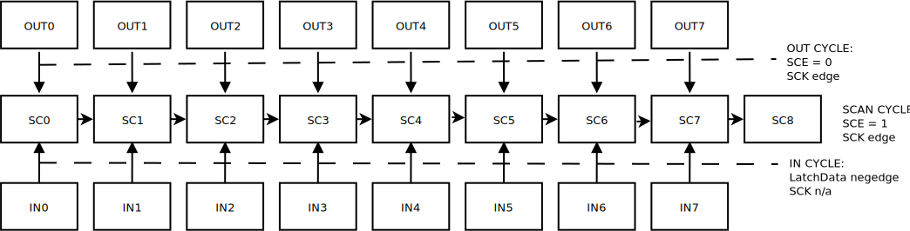

# Scan Chain Mailbox -- escaping the Tiny Tapeout scanchain for fun and speed

Initially this project was meant to get a RiscV core running faster than the 
constraints of the TinyTapeout3 scan chain.

I did not get to implement a useful CPU design but the designs have a working
mailbox that allows for clocking / input / output and scan chain design-to-design
communication at Mhz instead of Khz.

The mailbox then is used to drive a simple counter and adder with the message
contents.

## Scan Chain description

The TinyTapeout run 3 is based on a
[scan chain](https://github.com/TinyTapeout/tinytapeout-03/blob/main/verilog/rtl/scanchain/scanchain.v)
design that provides communication capabilities for each design with a small amount of pins.

There are several sets of bits of state for each design.
- SC[0..7] - scan chain data
- IN[0..7] - design visible input
- note that OUT[0..7] is not state -- it is up to the design to output something to
  these pins but it can be a combinatorial output based on IN or something else.

The external pins controlling the scan chain are as follows:
- SCK: **scan clock in** -- clock that drives the scan chain
- SCE: **scan select in** -- selects scan direction.
  - 1 pushes bits in SCAN CYCLE direction (SC0 => SC1 => SC2..)
  - 0 pushes bits in OUT CYCLE direction (OUT0 => SC0, OUT1 => SC1)
- **latch enable in** -- latch (independent of SCK) for IN CYCLE
  - latches data on 1 (SC0 => IN0, SC1 => IN1)
  - 0 keeps latched data on 0.
- **data in** - scan chain data input (from pin, or local to a design from SC8 of the previous design)
- **data out** - scan chain data output (into pin, or local to a design it is the SC8 to next SC0).

The following diagram has the illustration of the state:

## Escaping the scan chain -- fast clocking

In this section we show how we can clock the design at Mhz instead of the Khz normally 
allowed by the scan chain.

Code inside the design sets `tt_out[0] = !tt_in[0]`.

Let's assume that SC0 is now 0. If we send the following scan chain commands we get a clock cycle:
- IN CYCLE: pulse input latch so IN[0] = SC[0]. now IN[0] = 0.
- OUT CYCLE: SCE = 0, pulse SCK. SC[0] = OUT[0] = !IN[0] = 1. Now SC[0] = 1. IN[0] = 0.
- IN CYCLE: pulse input latch so IN[0] = SC[0]. now IN[0] = 1.
- OUT CYCLE: SCE = 0, pulse SCK. SC[0] = OUT[0] = !IN[0] = 0. Now SC[0] = 0. IN[0] = 1.

We can repeat this indefinitely. With four pulses of the scan chain we can clock one cycle of our designs.

If more than one design contain the same trick, then all the designs will be clocked 
together at the same time.

## Escaping the scan chain -- fast input

In this section, we show how we can push input data into our design and skip the queue of 
designs in front of it. We can input data at MHz instead of KHz.

Our design is several blocks in a row written by us. Code inside the designs is as follows:
- tt_out[0] = !tt_in[0]
- tt_out[7 downto 1] = 0;

- Let's initially assume IN[0] = 0. 
- Let's also focus on the second design (we initialize the first one to output some constant)

1. do an OUT CYCLE: SC = OUT.

| SC0 | SC1 | SC2| ...
|  1  |  0  |  0 | ...

2. do one or two SCAN CYCLE:

2A -- one scan cycle (note that 0s coming from the previous design).

| SC0 | SC1 | SC2| ...
|  0  |  1  |  0 | 0 | ...

2B -- two scan cyles

| SC0 | SC1 | SC2| ...
|  0  |  0  |  1 | 0 | ...

3. do an IN CYCLE either after 2A or after 2B.

Note that either IN0=0,IN1=1,IN2=0 or IN1=0,IN2=0,IN3=1.

If the design could distinguish between these two cases, it could infer one bit of 
information. We can use an RS flip-flop with IN1 the R and IN2 the S for the design
to be able to remember this state.

Note that if we do another (1) OUT CYCLE, the state will be the same as after step 1 
above and we can repeat the process. We can even combine this with the clocking
primitive to generate a clock cycle where the RS flip-flop state can be saved inside
a shift register inside the design (we call this the inbox).

Also note that during clocking, since OUT7..OUT1 is 0s then SC7..SC1 will be 0s and
so the RS flip flop state will remain unchanged. An additional detail is that we
stop the clocking when we know SC0 becomes 1 so that we can input another bit
into our RS FF.

### End-of-Frame signaling

For simplicity of framing, we also employ the same RS flip-flop trick above for another
set of pins IN3 and IN4. When this flip flop is set, it is considered a stopped bit 
and the full inbox message can be asserted as ready to a consumer outside.

Pushing a message to our design is done via pushing a bit at a time in IN1/IN2 with 
clocking followed by setting IN3 to mark the end of the message, followed by clocking
and IN4 to clear the end of the message condition.

## Escaping the scan chain -- broadcasting, block addresses and anti-stomping

Note that the message input system above results in a broadcast to all designs in 
synchrony.

We can do simplex to one design by using the regular TinyTapeout full scan chain of 
pushed bits and pushing 0s to other designs. We actually rely on this initially for 
establishing a different address for each block and reset handling.

After the reset handling and address establishment, a block knows whether it is the first
one (address of all 0s) or the last one (all 1s).

To prevent us from clocking other designs, the last design knows to output all 0s in some
states. Similarly, the first design knows to output 0s and 1s in a specific pattern.

A message can embed the address so that only some designs react to a given type of 
message.

## Escaping the scan chain -- multi-block chaining

One other goal of this project was to allow sequential blocks to talk to each other
more efficiently.

We rely on the fact that the commands are done in synchrony across all designs at
the same time along with the address in order to allow block I and block I+1 to
exchange a message without going outside the chip.

A special command inside the message format instructs the designs to enter "CHAIN OUTPUT"
mode for X cycles. In this mode the idea is as follows:
- design 0 outputs 0000_0001 (note that design 0 can start at position 100 or something)
- design 1 outputs ABC0_ABC1
- design 2 outputs DEF0_DEF1
- design 3 outputs GHI0_GHI1
....
- last design outputs 0000_0001
...

Our aim is to transmit ABC from design 1 to design 2, DEF from design 2 to design 3 and 
so on.

We shift the SCAN CHAIN by 4 cycles and do an IN CYCLE. The 0000 will reach the first
four inputs of design1, ABC0 the first four inputs of design 2, etc. The clock will
be 0 for all designs (except design 0).

We shift the SCAN CHAIN by 4 cycles again and do an IN CYCLE. Now the 0001 will reach the first four inputs of design 1, ABC1 the first four inputs of design 2, etc. The clock
will now be 1 for all designs.

After this, all designs past design 0 will have received 3 bits of information and a 
clock cycle. They then can start to send the next 3 bits for the number of cycles
we communicated in the initialy CHAIN OUTPUT command.

We can continue this for many cycles to transmit information sequentially along our
scan chain. In our design we use AB as the first 2 bits of the message and C as the
end-of-message condition which triggers a ready from the mailbox.

At the end of a chain output sequence, we can instruct design 0 and reset it again
or just leave it in this state which still allows us to use the input mode of
communication for designs 1 onwards.

## Escaping the scan chain -- fast output

Finally, we asked for our designs to be at the end of the scan chain so that we can
employ some fast output outside of the design also.

If our design receives a command for OUTSIDE OUTPUT, it outputs 7 bits of message
followed by a last bit with an end-of-message condition (equal to 0 until the last
cycle when it is 1).

We can use the first block which outputs 0000_0001 to clock whichever block we want the
output of. We then shift the bits all the way outside the chip. We then do an OUT CYCLE
and this resets the scan chain bits and we can clock our design again for the next 
output.

In this mode, our latency depends only on the distance to the scan chain end as the
OUT CYCLE resets the scan chain to a known state for another round of output to the
outside of the chip.
